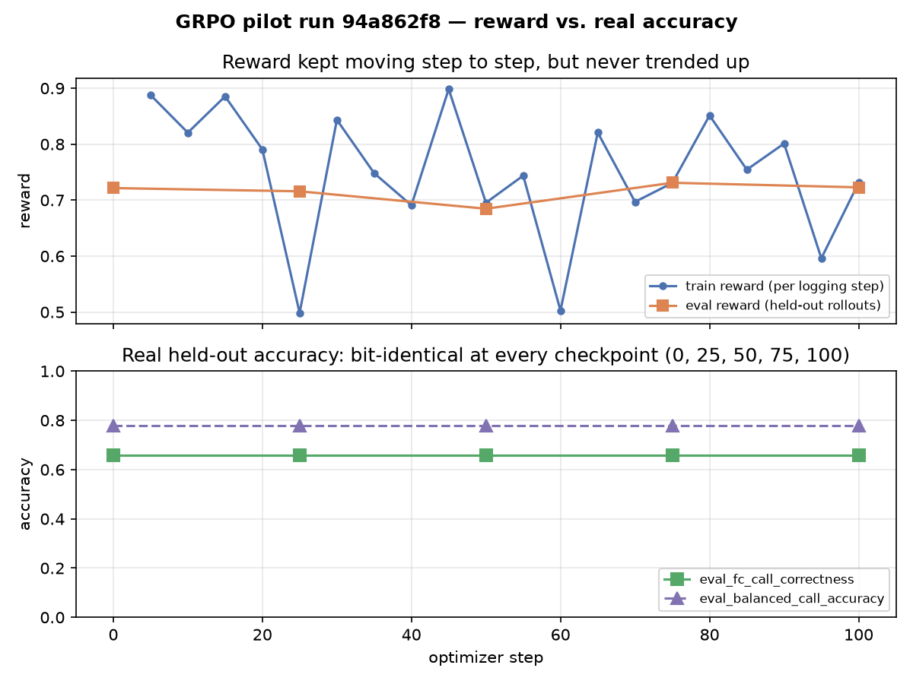
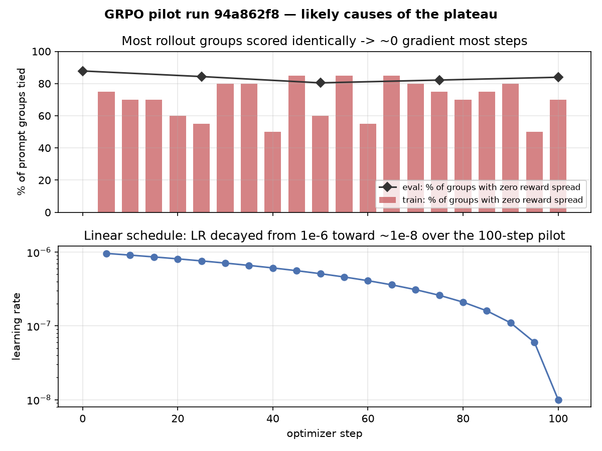

# 2. GRPO

Generation-based checkpoint evaluation uses the full validation split by default
(`--metrics-eval-samples 0`), including a step-zero measurement of the starting SFT
policy. The shared SFT callback saves per-turn predictions and paired conversation
bootstrap comparisons to this baseline; see `../1_sft/README.md` for report paths and
comparison commands. Positive sample counts remain available for smoke tests.
Reserve the test split for the final comparison after selecting a checkpoint.

**Why this exists as a separate, later stage — not the initial training loop:** function
calling has a rare property that makes RL genuinely attractive: the reward is trivially,
deterministically computable (parse the output, check the function name and arguments
against ground truth). That's almost exactly what `2_evaluations/run_internal_eval.py`
already does — so GRPO here is a way to optimize *directly* toward the metric that gates
promotion, instead of token-level match against ToolACE's one reference completion, and
to encode "some mistakes are worse than others" (hallucination vs. a minor formatting
miss) directly into the objective, which SFT has no way to express.

It's staged *after* `../1_sft/`, not instead of it, for concrete reasons:
- RL needs a policy that already produces a reasonable fraction of valid completions —
  starting GRPO from an untuned base model gives a near-zero, uninformative reward
  signal almost everywhere. SFT-then-RL is the standard pattern (this mirrors DeepSeek-R1's
  own "cold-start SFT, then RL" recipe), not RL from scratch.
- It's a real infra step up from SFT: rollout generation (sampling `num_generations`
  completions per prompt from the *current* policy, every step) instead of one
  forward/backward pass — meaningfully more compute per step, and something to budget
  GPU time for separately from serving.
- A buggy reward function gets *exploited*, not just ignored — GRPO will find and climb
  any gap in `compute_reward` (e.g. under-checking argument values). That demands the
  same adversarial scrutiny this project already applied to the eval's parsing edge
  cases (see `0_data/README.md`'s verification section), but now a miss teaches the
  model the wrong thing rather than just mis-scoring an eval run.

## Reward design

`compute_reward` (in `train_grpo.py`) mirrors `run_internal_eval.py`'s scoring
dimensions, collapsed into one scalar with partial credit:

| Case | Reward |
|---|---|
| Nonempty response with no parsed call when no call is expected | `+1.0` (heuristic; see below) |
| Empty/whitespace-only response | `-1.0` |
| Unwarranted call (no call expected, one made) | `-1.0` |
| Missed call (call expected, none made) | `-1.0` |
| Hallucinated call (function not in the tool list) | `-2.0` — worst case |
| Wrong function or incorrect number of invocations | `-0.5` |
| Right functions and counts, imperfect arguments | `0.1 + 0.7 × argument credit`, at most `0.8` |
| Right function, right arguments | `+1.0` |

The default `--reward-mode dense` grades arguments rather than giving all imperfect
calls the same reward. Each argument earns 0.25 for the correct top-level type and
0.75 for an exact typed value; nested type differences also invalidate exact value
credit. Divide by the union of expected/predicted keys, so missing and extra arguments
both reduce credit. Average across calls after maximum-weight one-to-one matching
within each function name. Repeated calls cannot double-count a good prediction.
Completely correct calls retain a separate 1.0 reward.

Use `--reward-mode legacy` for the original flat 0.3 partial reward and original
refusal behavior. Keep the SFT starting checkpoint, data, LR, temperature, group size,
and KL setting fixed for this ablation. Compare generated validation correctness and
its paired intervals; mean reward is not directly comparable between reward modes.

This does not make refusal scoring semantic: nonempty nonsense that parses as no call
can still receive positive reward on a no-call example, and the shared parser is
permissive. The blank-response loophole is closed in dense mode, but parser validity
and response-quality checks remain separate work before relying on this reward for
production refusal behavior.

Monitor TRL's `frac_reward_zero_std`, `reward_std`, completion lengths, and full-call
validation accuracy. Dense rewards may reduce ties but cannot guarantee useful
within-group variation. Startup prints `unique_prompts_per_generation_batch`; current
single-GPU defaults (batch 4, accumulation 2, G=8) give one unique prompt. A later
`--grad-accum 8` experiment gives four prompts per generation batch, with higher rollout
memory demand and fewer optimizer updates per epoch. It is not enabled by default.

This is a **starting design, not a final one** — the natural extension, once
`0_data/prepare_dataset.py`'s `risk_tier` field carries real values instead of
`"unclassified"`, is to scale the hallucination/wrong-function penalties by risk tier
(hallucinating a high-value transfer function should cost far more than hallucinating a
low-risk lookup) — directly wiring the business brief's risk-tiering into the training
objective, not just the eval gate.

## Held-out eval

Previously GRPO had none: the only correctness signal was `reward_func`, computed on
rollouts sampled from the *training* set — an optimization target, not a generalization
check, and with no "best" checkpoint to fall back on if the policy started drifting, just
whatever the final step produced.

Now `train_grpo.py` imports `FunctionCallEvalCallback` directly from `../1_sft/train_sft.py`
(not reimplemented — same reasoning as reusing `run_internal_eval.py`: the eval mechanism
and the metric name it reports, `fc_call_correctness`, should be identical across both
stages, not two copies that can quietly drift apart) and wires it up the same way SFT
does: `--val-file` (now required), `--eval-strategy`/`--eval-steps` (default `steps`/140),
`load_best_model_at_end=True` with `metric_for_best_model="fc_call_correctness"`. At the
end of `trainer.train()`, whichever checkpoint had the best real, generation-based
`fc_call_correctness` gets reloaded, merged, and saved — not necessarily the final step's.

Separately, passing `eval_dataset` to `GRPOTrainer` also turns on its own built-in
generation-based eval loop (reward/KL/entropy/completion-length, computed the same way as
training rollouts) on the held-out split, logged alongside `FunctionCallEvalCallback`'s
richer `metrics.py` breakdown — real cost, since it's full generation over the whole eval
set, not the cheap teacher-forced forward pass SFT's analogous eval loop uses; `--eval-batch-size`
and `num_generations_eval` (TRL's own `GRPOConfig` field) are the knobs if that turns out
to be too expensive for a given val split size.

## Code structure

- **`build_grpo_dataset`** — reuses `run_internal_eval.py`'s `build_eval_instances`
  (imported, not reimplemented): one row per assistant turn, same instances the internal
  eval scores checkpoints against. Columns: `prompt` (conversational messages, no
  target — GRPO generates it), `tool_names`, `is_call_case`, `expected_calls`.
  `expected_calls` is stored JSON-encoded rather than as a nested column — argument
  values are heterogeneous (str/int/float/list/dict) across examples, which breaks
  Arrow's struct-column type inference (`Dataset.from_dict` raised `ArrowInvalid:
  cannot mix struct and non-struct, non-null values` on the raw nested form — caught by
  actually running this against the real prepared data, not assumed).
- **`reward_func`** — TRL's `GRPOTrainer` reward-function contract: `completions` is one
  message per generation, every other dataset column is passed through as a
  same-length aligned list (verified against the installed `trl` version's
  `GRPOTrainer`/`trl.rewards` source, not assumed — the "extra columns become reward
  kwargs" behavior is exactly how `trl.rewards.think_format_reward` is written).
- **`enable_thinking=False`** via `GRPOConfig.chat_template_kwargs` — same non-thinking
  requirement as everywhere else in this project, so rollouts during training match how
  the model is actually served.

Historical legacy-reward verification without a GPU: `build_grpo_dataset` runs end-to-end against the real
`0_data/data/*.jsonl` splits, and `compute_reward`/`reward_func` were self-consistency
checked the same way `0_data/README.md` checked the call-syntax parser — feeding a
"perfect" prediction (the exact ground-truth call, or a plausible refusal) back through
`compute_reward` for every instance in `test.jsonl`: **all 648 score the maximum reward
(1.0)**, and the hallucination/wrong-function/wrong-argument cases score `-2.0`/`-0.5`/
`0.3` exactly as designed. `GRPOConfig`/`LoraConfig` construct cleanly with the flags
this script passes. Not verified here: an actual training run — that needs a GPU to load
`Qwen/Qwen3-8B` (or the SFT checkpoint) and run rollout generation, which this
environment doesn't have.

Current CPU tests (`tox -e sft-tests`) cover graded rewards, strict nested types,
missing/extra arguments, repeated-call matching, blank responses, reward input
alignment, and GRPO dataset construction. A tiny random Qwen model exercises one real
GRPO update plus baseline/checkpoint evaluation and merged-model saving. This checks
the training integration, not quality or GPU memory usage of the 8B model.

## Run

### Targeted SFT-error pilot (default Kubernetes job)

Add `--pilot` to the command below. This starts from the **post-SFT checkpoint**,
caps training at **100 optimizer updates**, uses four generations per prompt and
batch 4 × accumulation 4 (four unique prompts per update on one GPU). Evaluation
and saving run at steps 25/50/75/100, with a step-0 SFT baseline evaluation.
Explicit CLI flags override the preset. Completion and greedy-evaluation limits
remain 512 tokens: nine selected references in the local prepared data exceed 256.

The focus is the observed SFT errors, not token accuracy:

- **Unwarranted calls / missing information:** 128 clarification or inability
  targets, selected from training references after user turns.
- **Prerequisite handling and argument grounding:** 64 prerequisite-related call
  targets. All scalar reference arguments must occur in user/tool context.
- **Over-refusal guard:** 64 ordinary grounded call targets; valid calls still need
  to succeed. Call buckets backfill each other if one has too few candidates.

Selection is seeded, uses at most one target per training conversation, and excludes
exact validation-context overlaps. `pilot_selection.json` records source IDs, contexts,
references, bucket counts and data hashes. These lexical filters are **proxies**, not
proof of correct labels or confirmed SFT mistakes on those training examples. Review
the manifest for unsupported references. No BFCL or validation failures become
training examples, and the test split stays untouched.

The fixed 128-conversation validation probe is stratified by `call_type` (locally,
32 each of single/parallel/no-call/multi-turn). Both evaluation paths use these same
conversation IDs. Saved prediction reports include error slices with denominators,
failed conversation/turn IDs, truncation counts and wrong-call-count counts, including
repeated-tool and prerequisite-keyword slices. Prerequisite slices are not semantic
labels for premature action; inspect the saved predictions to establish that cause.

Checkpoint selection uses the mean of exact-call accuracy and no-call accuracy,
not token accuracy or training reward. Inspect **both** rates against step 0: a mean
gain can still hide over-refusal. Reports retain paired conversation-bootstrap
comparisons. The probe is development feedback, not a full-validation improvement
claim; evaluate any promising checkpoint and the SFT baseline on all validation
conversations before final comparison. No quality gain is guaranteed by this pilot.

Known reward limitation: a nonempty unparsed response can receive no-call credit
without actually asking a useful clarification question. Argument credit measures
reference agreement, not independent factual grounding. Thus manually inspecting
fixed failures remains necessary even if aggregate reward improves.

```bash
python train_grpo.py \
  --base-model ../1_sft/checkpoints/adapter-general \
  --train-file ../../0_data/data/train.jsonl \
  --val-file ../../0_data/data/val.jsonl \
  --output-dir checkpoints/grpo-general \
  --num-generations 8 --lr 1e-6 --epochs 1
```

### What happened in the first pilot run

MLflow run [`94a862f8`](http://localhost:5000/#/experiments/6/runs/94a862f8abc34fb1bd19d78572855292) (256 pilot
targets, 100 update steps, `--num-generations 4`, default linear LR schedule starting at `1e-6`,
`--kl-beta 0`): in plain terms, the model didn't change.



Training reward bounced between roughly 0.5 and 0.9 every step with no upward trend, and the
held-out accuracy numbers (`eval_fc_call_correctness`, `eval_balanced_call_accuracy`, the
call-only and no-call-only slices) came back **bit-for-bit identical** at every evaluation
checkpoint — step 0, 25, 50, 75, and 100. The model's actual predictions on held-out data never
moved at all, despite 100 real training steps.



Two things in the same run explain why:

- **Most sampled prompt groups had no learning signal.** 70–85% of the groups, most steps, scored
  every one of their `G` completions identically (zero reward spread) — see the "reward std"
  explanation above. A tied group contributes zero gradient, so most of the 100 steps weren't
  actually teaching the model anything.
- **The learning rate decayed to almost nothing.** The default linear schedule took `--lr 1e-6`
  down to `~1e-8` by step 100 — a 100x drop. Even the minority of steps that *did* have real signal
  were applying a vanishingly small update by the back half of the run.

This wasn't the SFT checkpoint already being "as good as it gets" — reward never got close to its
1.0 ceiling. It's that this particular pilot configuration didn't give the optimizer enough
live signal, at a high enough learning rate, to actually move the policy. Next things to try:
turn on `--select-by-rollout` (directly targets the tied-group problem above), and swap the
decaying `linear` schedule for `constant_with_warmup` on a short run like this, where the decay
tail was doing more harm than good.

## Rollout generation and batch sizing

Rollout generation is what makes a GRPO step expensive: `--num-generations` (8)
completions per prompt, each up to `--max-completion-length` (512) tokens, decoded
autoregressively *every step*, through the policy model's own `.generate()`
(`GRPOConfig.use_vllm` stays at its default of `False`). Routing that through vLLM was
tried and reverted — colocate mode needs `vllm` importable in the training process, and
installing it alongside the NGC image's CUDA stack breaks `peft`'s import-time
`transformer_engine` probe (`undefined symbol: cublasLtGroupedMatrixLayoutInit_internal`)
before training starts.

**`--per-device-batch-size` cannot be lowered on its own.** TRL derives
`generation_batch_size = per_device_batch_size × world_size × grad_accum` and rejects any
value not divisible by `--num-generations`, because a generation batch has to contain
whole prompt groups (verified against the installed `trl`'s own `GRPOConfig.__post_init__`,
not assumed). Hence the defaults: batch 4 with `--grad-accum 2` keeps
`generation_batch_size` at 8 = `G`, halving per-step activation memory without changing
the effective batch or the group size. Batch 4 with `--grad-accum 1` fails at startup.

The same rule applies to eval with its own group size: `--num-generations-eval` (2, well
below the training `G`) has to divide `--eval-batch-size` (4). Eval only needs completions
to score, not a group wide enough to estimate advantages from, so it also runs 4x less
generation than reusing `G=8` would.

`--mlflow`/`--mlflow-experiment-name`/`--mlflow-tracking-uri` and `--max-steps` mirror
`1_sft/train_sft.py`'s flags (same MLflowCallback wiring, same "override defaults via
CLI flags for a smoke run, never by editing the script" pattern).
