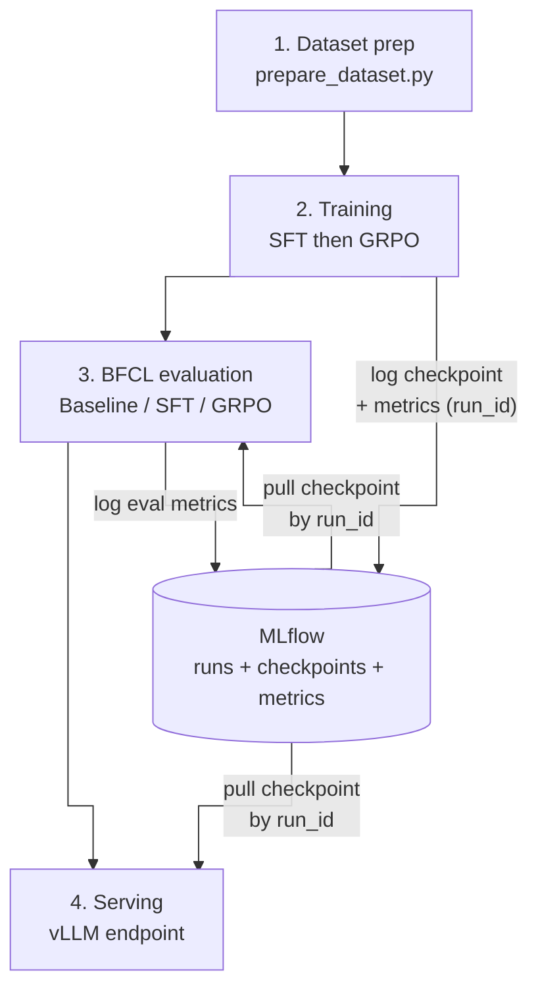

# fin_agent

Fine-tunes `Qwen/Qwen3-8B` for function-calling (SFT then GRPO on ToolACE), evaluates it
against BFCL and an internal risk-tiered suite, and serves it via vLLM — sized against a
fintech-style production budget of one H100 at 32 concurrent requests.

**Confirmed constraints:**
- Serving budget: **1× H100, 32 concurrent requests** in production.
- Training data: [`Team-ACE/ToolACE`](https://huggingface.co/datasets/Team-ACE/ToolACE)
  (Hugging Face) — 11.3K conversations, columns `system` (tool definitions + instructions)
  and `conversations` (turn list).
- Evaluation: Python subset of **BFCL** via
  [`bfcl-eval`](https://github.com/ShishirPatil/gorilla/tree/main/berkeley-function-call-leaderboard),
  plus an internal, risk-tiered eval against this project's own API schema.

## Project layout

```
fin_agent/
├── requirements.txt
├── 0_data/            # download ToolACE, map to internal schema, split, report stats
├── 1_training/         # 1_sft/ (LoRA SFT) then 2_grpo/ (GRPO RL) on the prepared splits
├── 2_evaluations/       # BFCL + internal risk-tiered accuracy eval, latency benchmark
├── 3_optimizations/     # quantization + serving-config sweep at 32-concurrency target
└── 4_deployment/        # production vLLM config, memory/capacity/cost calculations
```

Each phase directory has its own `README.md` explaining what it does and why, with the
`0_data → 1_training → 2_evaluations` phases implemented first; `3_optimizations` and
`4_deployment` carry the sizing/cost design (memory budget, capacity, cost model) and are
implemented next.

## Pipeline architecture



**What each stage actually gets from MLflow:**

| Stage | Relationship to MLflow |
|---|---|
| 1. Dataset prep | None — writes `train`/`val`/`test.jsonl` straight to a shared PVC, no tracking involved. |
| 2. Training | **Writes.** Both SFT and GRPO log their checkpoint + params + metrics as one MLflow run each, identified by `run_id`. |
| 3. BFCL evaluation | **Reads and writes.** Pulls the SFT/GRPO checkpoint being evaluated by `run_id` (the baseline needs no pull — it's the raw HF model), then logs `bfcl_non_live_ast_accuracy`/`bfcl_live_ast_accuracy` back to its own run. |
| 4. Serving | **Reads.** Pulls whichever checkpoint's `run_id` you point it at, the same mechanism evaluation uses. |

One asymmetry worth knowing: GRPO's own warm-start (SFT → GRPO inside stage 2) does
**not** go through MLflow — it always reads whatever `sft-job.yaml` most recently wrote
to a shared hostPath, not a specifically chosen SFT `run_id`. Every *downstream* consumer
of a checkpoint (evaluation, serving) is `run_id`-pinned; that one internal handoff isn't.

## Why Kubernetes and tox

The diagram above isn't one long-running program — it's four **kinds** of workload
(data prep, training, evaluation, serving), each run **many times** with different
inputs (which run_id, baseline vs SFT vs GRPO, smoke vs full scale), each needing its
own dependency stack, and all of them competing for the one GPU this project is
budgeted against. That's an orchestration problem independent of any one script being
correct — two tools split it, chosen for where the GPU actually is:

- **Kubernetes (`configs/`)** owns the *cluster* case: workloads that need a specific
  container image (the NGC PyTorch image for `sft`/`grpo` training vs.
  `vllm/vllm-openai` for MTP-capable serving — genuinely different, sometimes
  conflicting dependency trees that a single environment can't hold at once, confirmed
  the hard way this session when installing `vllm` into the NGC image broke
  `transformer_engine`'s CUDA library resolution), state that has to survive past any
  one pod's lifetime (checkpoints on a shared PVC that GRPO reads after SFT's pod is
  long gone, BFCL results surviving a Job retry), and the hard single-GPU constraint
  every template in this repo enforces explicitly (`nvidia.com/gpu: 1`, no
  time-slicing, `Recreate` deployment strategy — one workload at a time by
  construction, not convention). Code ships as ConfigMaps rebuilt from the current
  checkout, not baked into a custom image, specifically so "clone and run" doesn't
  depend on a container registry.
- **tox (`tox.ini`)** owns the *bare-host* case: the same "different workloads need
  different, sometimes conflicting dependencies" problem (`bfcl-eval`'s pinned
  `numpy==1.26.4` vs. `vllm`'s own resolver, for one real example already hit in this
  repo), solved with per-env virtualenvs instead of per-workload container images —
  the right-sized version of the same idea when there's no cluster to schedule
  against, just a GPU and a checkout. It's also, in practice, the faster debug loop: a
  `bfcl`/`vllm-serve` failure surfaces its full traceback directly in your own
  terminal, not filtered through `kubectl logs`, a stale ConfigMap, or a Job's own
  retry/backoff semantics — several of the real bugs fixed in this repo's history
  (a bare local-path MLflow artifact store unreachable outside the cluster, a
  half-copied checkpoint cache passing as complete, a missing `Python.h`) were only
  legible once run this way.

Same underlying problem — many distinct runs, many distinct environments, one GPU to
share between all of them — solved with the tool that actually matches where a given
run needs to happen, not one tool stretched to cover both.

## Setup

```bash
python -m venv .venv && source .venv/bin/activate
pip install -r requirements.txt
```

Training and evaluation run on a Kubernetes cluster (`configs/` — see its own README for
the full design). One-time cluster bootstrap:

```bash
./configs/setup/setup.sh
```

**After every `git pull`**, rebuild the ConfigMaps the Jobs below read their source code
from — a stale ConfigMap silently keeps running old code with no error otherwise:

```bash
./configs/setup/rebuild-configmaps.sh
```

## How to run

Each Job below is deleted before reapplying — Job pod templates are immutable, so a bare
`kubectl apply` over an existing Job of the same name fails rather than updating it.

### 1. Prepare the dataset

```bash
kubectl -n fin-agent delete job fin-agent-prepare-dataset --ignore-not-found --wait=true
kubectl apply -f configs/templates/training/prepare-dataset-job.yaml
kubectl -n fin-agent wait --for=condition=complete job/fin-agent-prepare-dataset --timeout=1800s
```

Writes `train`/`val`/`test.jsonl` to a shared PVC every job below reads from. Watch for
the `bfcl_ast_parseable=...` lines in its logs — that's the standing check confirming the
tool/parameter identifiers it wrote are genuinely valid Python, not just self-consistent
(see `0_data/README.md`'s verification section for why that distinction matters).

### 2. SFT training

```bash
kubectl -n fin-agent delete job fin-agent-sft --ignore-not-found --wait=true
kubectl apply -f configs/templates/training/sft-job.yaml
kubectl -n fin-agent logs -l app=fin-agent-sft -f
```

Run `sft-smoke-job.yaml` the same way first if you haven't validated the current code
end-to-end recently — cheap insurance before a run that takes hours. Logs to MLflow
(`--mlflow`, on by default in the template) — note the run_id from the logs or the MLflow
UI; step 4 needs it. See `1_training/1_sft/README.md`.

### 3. GRPO training

```bash
kubectl -n fin-agent delete job fin-agent-grpo --ignore-not-found --wait=true
kubectl apply -f configs/templates/training/grpo-job.yaml
kubectl -n fin-agent logs -l app=fin-agent-grpo -f
```

Warm-starts from step 2's checkpoint (`/checkpoints/sft` on the shared hostPath — run SFT
to completion first). Run `grpo-smoke-job.yaml` first for the same reason as step 2. See
`1_training/2_grpo/README.md`.

### 4. BFCL evaluation on a specific MLflow run_id

```bash
MODELS="sft" SFT_RUN_ID=<run_id from step 2> \
  ./configs/templates/inference/run-bfcl-eval-run-ids-suite.sh
```

Defaults to a cheap smoke pass; add `FULL_SCALE=1` for the real, leaderboard-comparable
`python` category (hours, not minutes). `MODELS="baseline sft grpo"` runs all three
(`GRPO_RUN_ID` for step 3's run_id). Logs `bfcl_non_live_ast_accuracy`/
`bfcl_live_ast_accuracy` to MLflow. A bare-host (no-kube) path also exists via `tox -e
bfcl` — see `2_evaluations/README.md`'s "Evaluating a specific MLflow run against BFCL"
section for both, plus the "just serve it, no eval" variant.

### 5. vLLM latency benchmark

Three steps: serve the checkpoint, port-forward it, run the benchmark. Repeat step 3 at
each concurrency level you want (1/8/16/24/32 — see "Confirmed constraints" above); each
run logs to MLflow as its own row, so they compare directly.

**1. Clear out anything already running, then serve the checkpoint on its run_id.** This
project targets a single GPU — any other leftover `fin-agent-vllm-*` Deployment (a
previous benchmark, a stale SFT/GRPO/baseline server) competes for it and can leave the
new pod stuck `Pending`, so check for and clear those too, not just `fin-agent-vllm-sft`:

```bash
kubectl -n fin-agent get deployments -l 'app in (fin-agent-vllm-sft,fin-agent-vllm-grpo,fin-agent-vllm-qwen3-8b)'
kubectl -n fin-agent delete deployment fin-agent-vllm-sft fin-agent-vllm-grpo fin-agent-vllm-qwen3-8b --ignore-not-found --wait=true
kubectl -n fin-agent delete service fin-agent-vllm-sft fin-agent-vllm-grpo fin-agent-vllm-qwen3-8b --ignore-not-found
sed -e 's/__NAME__/sft/g' -e 's/__RUN_ID__/<run_id from step 2>/g' \
  configs/templates/inference/vllm-serve-checkpoint.yaml | kubectl apply -f -
kubectl -n fin-agent rollout status deploy/fin-agent-vllm-sft --timeout=900s
kubectl -n fin-agent get pods -l app=fin-agent-vllm-sft   # confirm one pod, freshly created
```

**2. Kill any stale local port-forwards, then start fresh ones — each in its own
terminal, left running.** A `kubectl port-forward` left over from an earlier attempt can
still be bound to these local ports while pointing at a pod that's gone:

```bash
pkill -f "port-forward svc/fin-agent-vllm-sft" || true
pkill -f "port-forward svc/mlflow" || true
kubectl -n fin-agent port-forward svc/fin-agent-vllm-sft 8000:8000
```

And, in another terminal: `kubectl -n fin-agent port-forward svc/mlflow 5000:5000`.
Before step 3, confirm both are actually up — `curl http://localhost:8000/health` — a
dead port-forward fails every request with a plain connection-refused error, not a useful
one.

**3. Run the benchmark, in a third terminal:**

```bash
tox -e vllm-bench -- \
  --base-url http://localhost:8000 \
  --model Qwen/Qwen3-8B \
  --dataset-name hf \
  --dataset-path gorilla-llm/Berkeley-Function-Calling-Leaderboard \
  --bfcl-categories simple,multiple,parallel,parallel_multiple \
  --num-prompts 100 \
  --concurrencies 16,32,64
```

(`--concurrencies` runs the whole benchmark once per value, all logged into a single
MLflow run with each value's metrics/params prefixed `c<N>_` — e.g. `c32_mean_ttft_ms` —
so they sit side by side. Swap in `--max-concurrency 32` instead for a single level,
logged unprefixed as its own run.)

Logs mean/median/p50/p95/p99 TTFT, TPOT, inter-token latency, and request/output/total-
token throughput to MLflow. Uses `vllm`'s own built-in `BFCLDataset` loader — real
tool-calling traffic, no custom conversion code — but sends tools via the native
`tools`/`tool_choice` API, whereas this project's fine-tune uses prompting-style tool
calls (tools as text in the system message); realistic tool-calling-*shaped* load, not an
exact replica of this model's production request format.

Tear the Deployment down when done:
`kubectl -n fin-agent delete deployment fin-agent-vllm-sft && kubectl -n fin-agent delete
service fin-agent-vllm-sft --ignore-not-found`.
