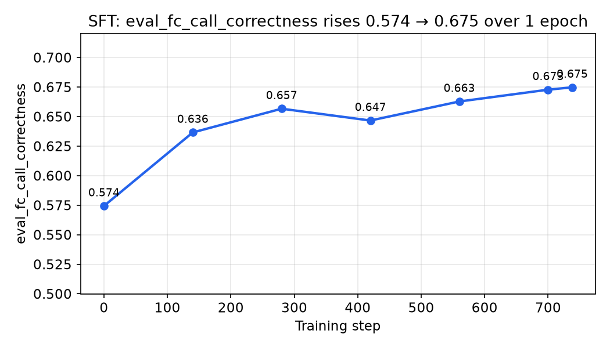
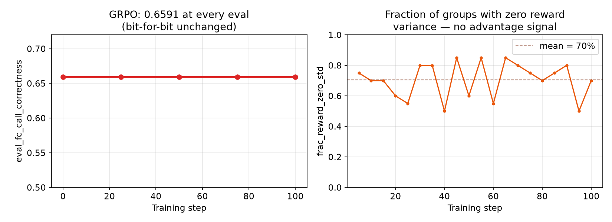
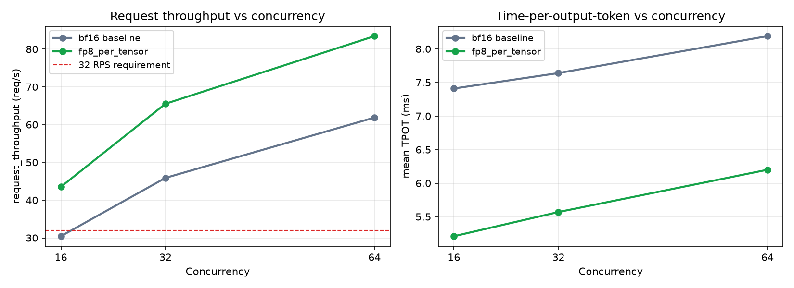
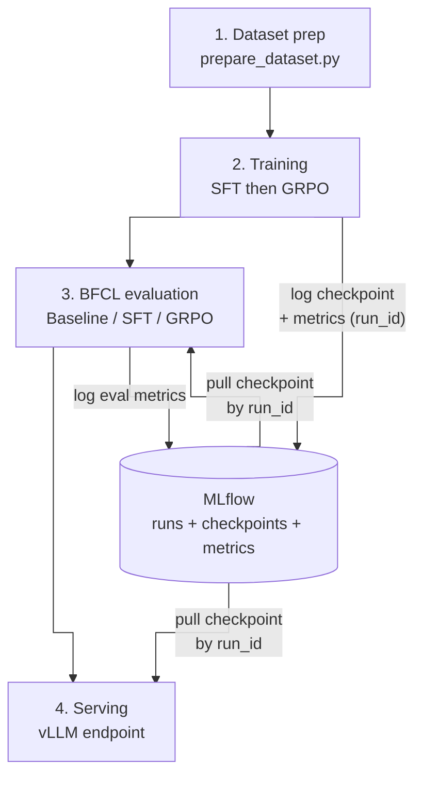

# fin_agent

Fine-tunes `Qwen/Qwen3-8B` for function-calling (SFT then GRPO on ToolACE), evaluates it
against BFCL and an internal risk-tiered suite, and serves it via vLLM — sized against a
fintech-style production budget of one H100 at 32 concurrent requests.

## What this is

A small open model, taught to be a reliable, cheap tool-calling agent, run against a
production-shaped budget end to end: **prepare data → SFT → GRPO → evaluate against BFCL
→ quantize → serve at 32 concurrent requests on one H100**, with every stage's checkpoint,
config, and metric logged to MLflow so a number in this document is always one `run_id`
away from the run that produced it. The two sections below walk through what actually
happened at each stage, with the real numbers.

**Pipeline, at a glance** (full diagram, MLflow read/write contract, and orchestration
rationale further down in [Pipeline architecture](#pipeline-architecture)):

1. **Dataset prep** — ToolACE conversations mapped to this project's own tool schema.
2. **SFT** — LoRA fine-tune on the prepared conversations. ✅ succeeded — see below.
3. **GRPO** — RL fine-tune on top of the SFT checkpoint, rewarding exactly the error
   modes SFT's own eval surfaced. ⚠️ pilot run produced ~no learning signal — see below.
4. **BFCL evaluation** — baseline vs. SFT vs. SFT+FP8, against the public leaderboard.
5. **Serving** — vLLM, FP8-quantized, sized for 32 concurrent requests on one H100.

## Results

### 1. SFT: a successful training run, and why `eval_fc_call_correctness` is the BFCL proxy

BFCL requires standing up a full vLLM server and running the whole suite — too slow to
check during training. `train_sft.py` runs a smaller eval every 140 steps instead
(`FunctionCallEvalCallback` in [1_training/1_sft/train_sft.py](1_training/1_sft/train_sft.py)):
real `model.generate()` (not teacher-forced) on a held-out sample, scored by
[`call_correctness()`](1_training/1_sft/metrics.py) — the fraction of call-case turns
whose generated call (function name **and** arguments) exactly matches the expected call.

Why it stands in for BFCL: same success criterion (exact call match from real generation,
not teacher-forced accuracy) as BFCL's own AST-match scoring — just computed on this
project's own eval set instead of the public one.



The run (`thundering-worm-655`, [MLflow](http://localhost:5000/#/experiments/5/runs/ba61b7db97b24406b608ffa8ee2deae6/model-metrics)):

| Metric | Start (step 0) | End (step 738, 1 epoch) |
|---|---|---|
| `eval_fc_call_correctness` | 0.574 | **0.675** (+10.0 pts) |
| `eval_loss` | 0.86 | 0.238 |
| `eval_mean_token_accuracy` | 0.72 | 0.929 |
| `eval_hallucination_rate` | 0.0 | 0.0 (transient 1.6% spike at step 140, gone by 280) |
| `eval_tool_selection_exact_match` | — | 0.946 |
| `eval_param_value_accuracy` | — | 0.859 |
| `eval_refusal_accuracy` | — | 0.895 |
| `eval_trajectory_accuracy` (full multi-turn exact match) | — | 0.375 |

Training moved `full_call_accuracy` by **+10.0 pts** (95% CI [6.3, 13.9]) and
`refusal_accuracy` by **+24.8 pts** (95% CI [18.4, 31.8]) against its own step-0 eval,
logged directly as `eval_vs_baseline_*_delta`, not eyeballed off the chart.
`eval_trajectory_accuracy` (0.375) requires *every* turn in a multi-turn conversation
correct — expected to sit well below the 0.946 single-call rate, not a red flag on its own.

**Error breakdown, final checkpoint** (rate per call case, `n`=498):

| Error type | Rate |
|---|---|
| Wrong argument value | **11.2%** |
| Wrong tool selected | 3.1% |
| Unwarranted call (should have refused) | 2.5% |
| Extra parameter | 1.5% |
| Missing parameter | 1.4% |
| Wrong parameter type | 2.2% |
| Missed a required call | 1.1% |
| Hallucinated a nonexistent tool | 0.0% |

Wrong argument *values* dominate by a wide margin — tool selection is close to solved
(96.9% correct) but getting the right value into a correctly-chosen call is the remaining
gap. That's the failure surface GRPO targets next.

### 2. GRPO: the attempt, and what the numbers say didn't work

Warm-started from the SFT checkpoint (`sedate-sheep-553`, a 256-prompt/100-step pilot,
[MLflow](http://localhost:5000/#/experiments/6/runs/94a862f8abc34fb1bd19d78572855292)).
`compute_reward` in [train_grpo.py](1_training/2_grpo/train_grpo.py) cascades by
severity — hallucinated call worst, then wrong function, then missing/extra invocations,
then partial credit for argument correctness — covering the same failure surface as the
SFT error breakdown above.



It didn't move anything: `eval_fc_call_correctness` was **0.6591 at every one of five
eval checkpoints** (steps 0, 25, 50, 75, 100) — bit-for-bit identical. The cause shows up
in `frac_reward_zero_std`, averaging **~70%** over the run (range 50–85%): GRPO's
advantage is the reward normalized *within* each group of `num_generations` (4)
completions per prompt, so a group where every sample scores the same contributes zero
gradient. At ~70%, most steps had little to learn from.

Unused in this run: `--select-by-rollout` filters training prompts down to ones where
sampled rollouts actually disagree, and `--stall-check-step` halts a run early once no
eval metric has moved. This was also a pilot (`pilot=True`, logged), not the full
`grpo-job.yaml` config.

### 3. BFCL: SFT checkpoint vs. baseline vs. the public leaderboard

Full `python`-category BFCL (3,491 cases):

| | Baseline | SFT | SFT + FP8 | Leaderboard ref. |
|---|---|---|---|---|
| `bfcl_non_live_ast_accuracy` | 0.902 | **0.917** (+1.5) | 0.917 | 0.886 |
| `bfcl_live_ast_accuracy` | 0.720 | **0.790** (+7.0) | 0.784 | 0.801 |
| `bfcl_overall_accuracy` | 0.785 | **0.835** (+5.0) | 0.831 | — |

([baseline](http://localhost:5000/#/experiments/7/runs/b8f2e219f2f0463b9d62f0d0a56c6567) ·
[SFT](http://localhost:5000/#/experiments/8/runs/b5a846123ee6431b850555b851d31e6c) ·
[SFT+FP8](http://localhost:5000/#/experiments/11/runs/44efe2b96bb74385a0e4dd0620e174af))

SFT clears the leaderboard reference on Non-Live and closes nearly all the gap on Live
(0.790 vs. 0.801, within this suite's ±1.7-pt noise band at this sample size). FP8 costs
**−0.4 pts overall — inside the noise band**. `bfcl_live_relevance_accuracy` (an 18-case
slice) dropped from 1.0 at baseline to 0.722 after SFT.

### 4. Serving: FP8 quantization and concurrency



`tox -e vllm-bench` sweep, same checkpoint, bf16 vs. FP8
([bf16](http://localhost:5000/#/experiments/9/runs/2bd5b009d1f041e0b9980b7f2b105f6a) ·
[FP8](http://localhost:5000/#/experiments/9/runs/94c48a84f5194f2fa5ce2f8248f0ac57)):

| Concurrency | req/s bf16 | req/s FP8 | TTFT ms bf16 | TTFT ms FP8 | TPOT ms bf16 | TPOT ms FP8 |
|---|---|---|---|---|---|---|
| 16 | 30.4 | 43.5 (+43%) | 29.3 | 25.3 | 7.41 | 5.21 |
| 32 | 45.9 | 65.5 (+43%) | 45.8 | 47.7 | 7.64 | 5.57 |
| 64 | 61.9 | 83.4 (+35%) | 109.0 | 95.1 | 8.19 | 6.20 |

**Concurrency target.** Confirmed constraint: 32 concurrent requests — the benchmark's
`--concurrencies 32` row. Measured `request_throughput` there: 45.9 req/s (bf16), 65.5
req/s (FP8).

**Three metrics:**
- **TTFT** — prefill time: one pass over the input prompt, before any output token exists.
- **TPOT** — time per output token after the first (decode), one token at a time.
- **`request_throughput`** — completed requests/sec across all concurrent traffic.

**TTFT vs. total latency.** Inputs average ~367 tokens, outputs ~58–60 — over 6:1, why TTFT
is tracked separately for this workload. But it's not the biggest cost: at concurrency 32
(FP8), TTFT is 47.7ms vs. decode (`TPOT × output_tokens`) ≈321ms — TTFT is only ~13% of the
≈369ms total. Decode dominates because it's sequential; prefill is one parallel pass.

**KV-cache gap.** Not logged yet — neither bench run captures anything cache-related.
vLLM exposes it via its own `/metrics` endpoint (`vllm:kv_cache_usage_perc`); scraping that
alongside a future benchmark run is coming soon.

**Throughput numbers.** `output_throughput` (tokens/s, all requests summed) climbs 208→4,890
tok/s (FP8, c1→c64) — more requests sharing each decode step, not faster individual
generation. `mean_tpot` moves the opposite way, getting worse with concurrency (FP8:
4.62→6.20ms) for the same reason. `request_throughput` should track both
(`~concurrency / (TTFT + output_tokens × TPOT)`), but at concurrency 32 it improves +43%
against only −27% TPOT and flat TTFT — a gap this data doesn't explain.

**Confirmed constraints:**
- Serving budget: **1× H100, 32 concurrent requests** in production.
- Training data: [`Team-ACE/ToolACE`](https://huggingface.co/datasets/Team-ACE/ToolACE)
  (Hugging Face) — 11.3K conversations, columns `system` (tool definitions + instructions)
  and `conversations` (turn list).
- Evaluation: Python subset of **BFCL** via
  [`bfcl-eval`](https://github.com/ShishirPatil/gorilla/tree/main/berkeley-function-call-leaderboard),
  plus an internal, risk-tiered eval against this project's own API schema.

## Project layout

```
fin_agent/
├── requirements.txt
├── 0_data/            # download ToolACE, map to internal schema, split, report stats
├── 1_training/         # 1_sft/ (LoRA SFT) then 2_grpo/ (GRPO RL) on the prepared splits
├── 2_evaluations/       # BFCL + internal risk-tiered accuracy eval, latency benchmark
├── 3_optimizations/     # quantization + serving-config sweep at 32-concurrency target
└── 4_deployment/        # production vLLM config, memory/capacity/cost calculations
```

Each phase directory has its own `README.md` explaining what it does and why, with the
`0_data → 1_training → 2_evaluations` phases implemented first; `3_optimizations` and
`4_deployment` carry the sizing/cost design (memory budget, capacity, cost model) and are
implemented next.

## Pipeline architecture



**What each stage actually gets from MLflow:**

| Stage | Relationship to MLflow |
|---|---|
| 1. Dataset prep | None — writes `train`/`val`/`test.jsonl` straight to a shared PVC, no tracking involved. |
| 2. Training | **Writes.** Both SFT and GRPO log their checkpoint + params + metrics as one MLflow run each, identified by `run_id`. |
| 3. BFCL evaluation | **Reads and writes.** Pulls the SFT/GRPO checkpoint being evaluated by `run_id` (the baseline needs no pull — it's the raw HF model), then logs `bfcl_non_live_ast_accuracy`/`bfcl_live_ast_accuracy` back to its own run. |
| 4. Serving | **Reads.** Pulls whichever checkpoint's `run_id` you point it at, the same mechanism evaluation uses. |

One asymmetry worth knowing: GRPO's own warm-start (SFT → GRPO inside stage 2) does
**not** go through MLflow — it always reads whatever `sft-job.yaml` most recently wrote
to a shared hostPath, not a specifically chosen SFT `run_id`. Every *downstream* consumer
of a checkpoint (evaluation, serving) is `run_id`-pinned; that one internal handoff isn't.

## Why Kubernetes and tox

The diagram above isn't one long-running program — it's four **kinds** of workload
(data prep, training, evaluation, serving), each run **many times** with different
inputs (which run_id, baseline vs SFT vs GRPO, smoke vs full scale), each needing its
own dependency stack, and all of them competing for the one GPU this project is
budgeted against. That's an orchestration problem independent of any one script being
correct — two tools split it, chosen for where the GPU actually is:

- **Kubernetes (`configs/`)** owns the *cluster* case: workloads that need a specific
  container image (the NGC PyTorch image for `sft`/`grpo` training vs.
  `vllm/vllm-openai` for speculative-decoding-capable serving — genuinely different, sometimes
  conflicting dependency trees that a single environment can't hold at once, confirmed
  the hard way this session when installing `vllm` into the NGC image broke
  `transformer_engine`'s CUDA library resolution), state that has to survive past any
  one pod's lifetime (checkpoints on a shared PVC that GRPO reads after SFT's pod is
  long gone, BFCL results surviving a Job retry), and the hard single-GPU constraint
  every template in this repo enforces explicitly (`nvidia.com/gpu: 1`, no
  time-slicing, `Recreate` deployment strategy — one workload at a time by
  construction, not convention). Code ships as ConfigMaps rebuilt from the current
  checkout, not baked into a custom image, specifically so "clone and run" doesn't
  depend on a container registry.
- **tox (`tox.ini`)** owns the *bare-host* case: the same "different workloads need
  different, sometimes conflicting dependencies" problem (`bfcl-eval`'s pinned
  `numpy==1.26.4` vs. `vllm`'s own resolver, for one real example already hit in this
  repo), solved with per-env virtualenvs instead of per-workload container images —
  the right-sized version of the same idea when there's no cluster to schedule
  against, just a GPU and a checkout. It's also, in practice, the faster debug loop: a
  `bfcl`/`vllm-serve` failure surfaces its full traceback directly in your own
  terminal, not filtered through `kubectl logs`, a stale ConfigMap, or a Job's own
  retry/backoff semantics — several of the real bugs fixed in this repo's history
  (a bare local-path MLflow artifact store unreachable outside the cluster, a
  half-copied checkpoint cache passing as complete, a missing `Python.h`) were only
  legible once run this way.

Same underlying problem — many distinct runs, many distinct environments, one GPU to
share between all of them — solved with the tool that actually matches where a given
run needs to happen, not one tool stretched to cover both.

## Setup

```bash
python -m venv .venv && source .venv/bin/activate
pip install -r requirements.txt
```

Training and evaluation run on a Kubernetes cluster (`configs/` — see its own README for
the full design). One-time cluster bootstrap:

```bash
./configs/setup/setup.sh
```

**After every `git pull`**, rebuild the ConfigMaps the Jobs below read their source code
from — a stale ConfigMap silently keeps running old code with no error otherwise:

```bash
./configs/setup/rebuild-configmaps.sh
```

## How to run

Each Job below is deleted before reapplying — Job pod templates are immutable, so a bare
`kubectl apply` over an existing Job of the same name fails rather than updating it.

### 1. Prepare the dataset

```bash
kubectl -n fin-agent delete job fin-agent-prepare-dataset --ignore-not-found --wait=true
kubectl apply -f configs/templates/training/prepare-dataset-job.yaml
kubectl -n fin-agent wait --for=condition=complete job/fin-agent-prepare-dataset --timeout=1800s
```

Writes `train`/`val`/`test.jsonl` to a shared PVC every job below reads from. Watch for
the `bfcl_ast_parseable=...` lines in its logs — that's the standing check confirming the
tool/parameter identifiers it wrote are genuinely valid Python, not just self-consistent
(see `0_data/README.md`'s verification section for why that distinction matters).

### 2. SFT training

```bash
kubectl -n fin-agent delete job fin-agent-sft --ignore-not-found --wait=true
kubectl apply -f configs/templates/training/sft-job.yaml
kubectl -n fin-agent logs -l app=fin-agent-sft -f
```

Run `sft-smoke-job.yaml` the same way first if you haven't validated the current code
end-to-end recently — cheap insurance before a run that takes hours. Logs to MLflow
(`--mlflow`, on by default in the template) — note the run_id from the logs or the MLflow
UI; step 4 needs it. See `1_training/1_sft/README.md`.

### 3. GRPO training

```bash
kubectl -n fin-agent delete job fin-agent-grpo --ignore-not-found --wait=true
kubectl apply -f configs/templates/training/grpo-job.yaml
kubectl -n fin-agent logs -l app=fin-agent-grpo -f
```

Warm-starts from step 2's checkpoint (`/checkpoints/sft` on the shared hostPath — run SFT
to completion first). Run `grpo-smoke-job.yaml` first for the same reason as step 2. See
`1_training/2_grpo/README.md`.

### 4. BFCL evaluation on a specific MLflow run_id

```bash
MODELS="sft" SFT_RUN_ID=<run_id from step 2> \
  ./configs/templates/inference/run-bfcl-eval-run-ids-suite.sh
```

Defaults to a cheap smoke pass; add `FULL_SCALE=1` for the real, leaderboard-comparable
`python` category (hours, not minutes). `MODELS="baseline sft grpo"` runs all three
(`GRPO_RUN_ID` for step 3's run_id). Logs `bfcl_non_live_ast_accuracy`/
`bfcl_live_ast_accuracy` to MLflow, plus per-cause failure counts and a
`bfcl_diagnosis.md` artifact saying where the losses are and what to do about them. A
bare-host (no-kube) path also exists via `tox -e bfcl` — see `2_evaluations/README.md`'s
"Evaluating a specific MLflow run against BFCL" section for both, plus the "just serve
it, no eval" variant.

**Quantized parity check.** `QUANTIZATION` serves the same artifacts through vLLM's
online (load-time) quantization, so no separate checkpoint is needed:

```bash
QUANTIZATION=fp8_per_tensor FULL_SCALE=1 MODELS="baseline sft" \
  SFT_RUN_ID=<run_id from step 2> \
  ./configs/templates/inference/run-bfcl-eval-run-ids-suite.sh
```

Every identifier gets a suffix (`-fp8-per-tensor`) — Deployment, Service, Job, results
directory and MLflow experiment — so quantized results sit *beside* the bf16 numbers
they're meant to be compared against rather than overwriting them. Each run also records
a `quantization` param and tag (`none` for unquantized), so the two are groupable in
MLflow by one key instead of by reading experiment-name suffixes. Read the deltas against
the noise band rather than as exact numbers: at 3491 cases that's roughly ±1.6 pts on
Non-Live and ±1.7 on Live. If the image rejects `fp8_per_tensor`, plain `fp8` is the
older, broadly-supported spelling of the same thing.

### 5. vLLM latency benchmark

To benchmark all four serving configs below (bf16, FP8 weights, FP8 weights+KV-cache,
FP8 weights+KV-cache+DFlash speculative decoding) in one command, use
`configs/templates/inference/run-vllm-bench-quantization-suite.sh` — see
`configs/README.md`'s entry for it. Otherwise, three manual steps: serve the checkpoint,
port-forward it, run the benchmark. Repeat step 3 at each concurrency level you want
(1/8/16/24/32 — see "Confirmed constraints" above); each run logs to MLflow as its own
row, so they compare directly.

**1. Clear out anything already running, then serve the checkpoint on its run_id.** This
project targets a single GPU — any other leftover `fin-agent-vllm-*` Deployment (a
previous benchmark, a stale SFT/GRPO/baseline server) competes for it and can leave the
new pod stuck `Pending`, so check for and clear those too, not just `fin-agent-vllm-sft`:

```bash
kubectl -n fin-agent get deployments -l 'app in (fin-agent-vllm-sft,fin-agent-vllm-grpo,fin-agent-vllm-qwen3-8b)'
kubectl -n fin-agent delete deployment fin-agent-vllm-sft fin-agent-vllm-grpo fin-agent-vllm-qwen3-8b --ignore-not-found --wait=true
kubectl -n fin-agent delete service fin-agent-vllm-sft fin-agent-vllm-grpo fin-agent-vllm-qwen3-8b --ignore-not-found
sed -e 's/__NAME__/sft/g' -e 's/__RUN_ID__/<run_id from step 2>/g' -e 's/__VLLM_EXTRA_ARGS__//g' \
  configs/templates/inference/vllm-serve-checkpoint.yaml | kubectl apply -f -
kubectl -n fin-agent rollout status deploy/fin-agent-vllm-sft --timeout=900s
kubectl -n fin-agent get pods -l app=fin-agent-vllm-sft   # confirm one pod, freshly created
```

To benchmark a **quantized** server instead, substitute the quantization flag and use a
distinct `__NAME__` so it doesn't collide with the unquantized Deployment (everything
below then targets `fin-agent-vllm-sft-fp8`):

```bash
sed -e 's/__NAME__/sft-fp8/g' -e 's/__RUN_ID__/<run_id from step 2>/g' \
  -e 's/__VLLM_EXTRA_ARGS__/--quantization fp8_per_tensor/g' \
  configs/templates/inference/vllm-serve-checkpoint.yaml | kubectl apply -f -
kubectl -n fin-agent rollout status deploy/fin-agent-vllm-sft-fp8 --timeout=900s
```

**KV-cache in FP8** is a separate flag (`--kv-cache-dtype`, not `--quantization`) —
quantizes the cached keys/values themselves rather than the model weights, and can be
combined with weight quantization or used alone:

```bash
sed -e 's/__NAME__/sft-kvfp8/g' -e 's/__RUN_ID__/<run_id from step 2>/g' \
  -e 's/__VLLM_EXTRA_ARGS__/--kv-cache-dtype fp8_e4m3/g' \
  configs/templates/inference/vllm-serve-checkpoint.yaml | kubectl apply -f -
kubectl -n fin-agent rollout status deploy/fin-agent-vllm-sft-kvfp8 --timeout=900s
```

**DFlash speculative decoding** (FP8 weights + FP8 KV-cache + a separate drafter model,
`z-lab/Qwen3-8B-DFlash-b16`, proposing 4 candidate tokens per step) uses its own template
with everything baked in — not `__VLLM_EXTRA_ARGS__`, since the drafter's model id
collides with `sed`'s own `/` delimiter. Not MTP: MTP needs a checkpoint with a trained
MTP head, which this project's fine-tunes don't have — see the template's header for the
verified config, sourced from vLLM's own test suite:

```bash
sed -e 's/__NAME__/sft-fp8-dflash/g' -e 's/__RUN_ID__/<run_id from step 2>/g' \
  configs/templates/inference/vllm-serve-checkpoint-fp8-dflash.yaml | kubectl apply -f -
kubectl -n fin-agent rollout status deploy/fin-agent-vllm-sft-fp8-dflash --timeout=900s
```

**2. Kill any stale local port-forwards, then start fresh ones — each in its own
terminal, left running.** A `kubectl port-forward` left over from an earlier attempt can
still be bound to these local ports while pointing at a pod that's gone:

```bash
pkill -f "port-forward svc/fin-agent-vllm-sft" || true
pkill -f "port-forward svc/mlflow" || true
kubectl -n fin-agent port-forward svc/fin-agent-vllm-sft 8000:8000
```

And, in another terminal: `kubectl -n fin-agent port-forward svc/mlflow 5000:5000`.
Before step 3, confirm both are actually up — `curl http://localhost:8000/health` — a
dead port-forward fails every request with a plain connection-refused error, not a useful
one.

**3. Run the benchmark, in a third terminal:**

```bash
tox -e vllm-bench -- \
  --base-url http://localhost:8000 \
  --model Qwen/Qwen3-8B \
  --dataset-name hf \
  --dataset-path gorilla-llm/Berkeley-Function-Calling-Leaderboard \
  --bfcl-categories simple,multiple,parallel,parallel_multiple \
  --num-prompts 100 \
  --concurrencies 16,32,64
```

(`--concurrencies` runs the whole benchmark once per value, all logged into a single
MLflow run with each value's metrics/params prefixed `c<N>_` — e.g. `c32_mean_ttft_ms` —
so they sit side by side. Swap in `--max-concurrency 32` instead for a single level,
logged unprefixed as its own run.)

Logs mean/median/p50/p95/p99 TTFT, TPOT, inter-token latency, and request/output/total-
token throughput to MLflow. Uses `vllm`'s own built-in `BFCLDataset` loader — real
tool-calling traffic, no custom conversion code — but sends tools via the native
`tools`/`tool_choice` API, whereas this project's fine-tune uses prompting-style tool
calls (tools as text in the system message); realistic tool-calling-*shaped* load, not an
exact replica of this model's production request format.

**Comparing across variants.** Run the sweep once per Deployment (bf16 / FP8 weights /
FP8 weights+KV-cache / FP8 weights+KV-cache+DFlash), labelling each so the runs are
distinguishable in MLflow — `run-vllm-bench-quantization-suite.sh` does exactly this
loop automatically:

```bash
# ... --base-url http://localhost:8000 (whichever server is port-forwarded) ...
  --concurrencies 1,8,16,32,64 --label bf16
  # then --label fp8_per_tensor, --label fp8_weights_and_kv, --label fp8_weights_kv_dflash
```

Keep `--gpu-memory-utilization` identical (0.5) across all four or the comparison
confounds two variables. The benchmark logs `kv_cache_usage_perc_mean`/`_max` (scraped
from the server's own `/metrics`) alongside throughput/TTFT/TPOT — the number to check
whether `--kv-cache-dtype fp8_e4m3` actually grows usable cache headroom, rather than
inferring it from throughput alone.

Tear the Deployment down when done:
`kubectl -n fin-agent delete deployment fin-agent-vllm-sft && kubectl -n fin-agent delete
service fin-agent-vllm-sft --ignore-not-found`.
