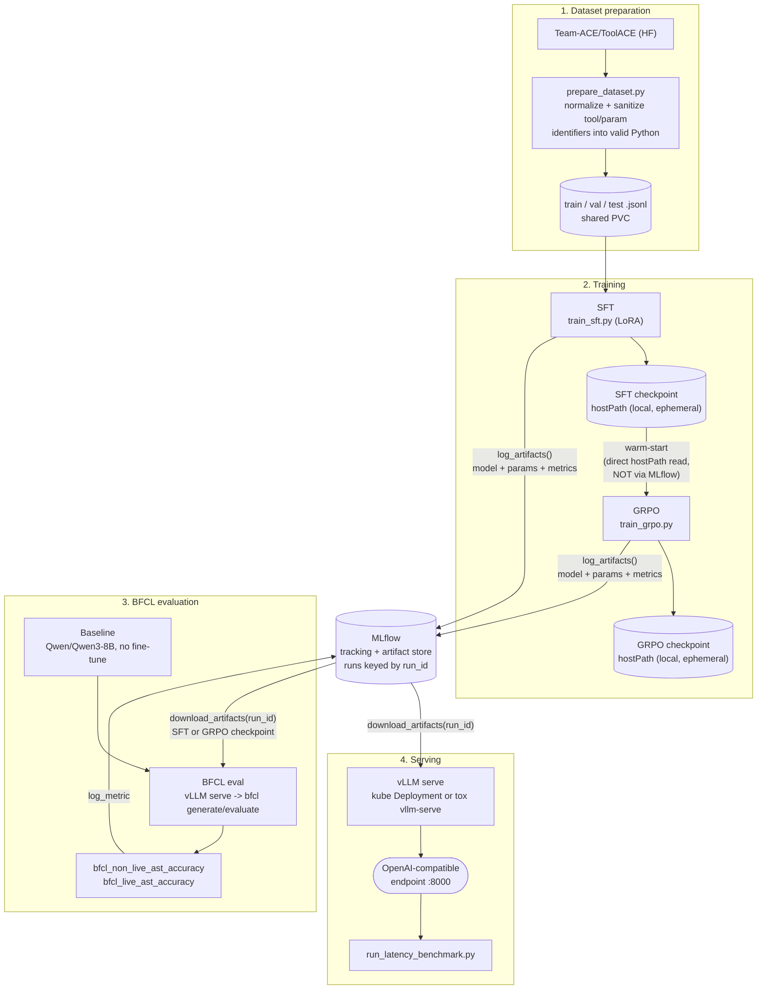

# fin_agent

A fine-tuned, function-calling LLM that lets a FinTech agent turn natural-language
instructions into precise calls against internal APIs (fraud detection, transaction
processing), served in production on a single H100.

**Confirmed constraints:**
- Serving budget: **1× H100, 32 concurrent requests** in production.
- Training data: [`Team-ACE/ToolACE`](https://huggingface.co/datasets/Team-ACE/ToolACE)
  (Hugging Face) — 11.3K conversations, columns `system` (tool definitions + instructions)
  and `conversations` (turn list).
- Evaluation: Python subset of **BFCL** via
  [`bfcl-eval`](https://github.com/ShishirPatil/gorilla/tree/main/berkeley-function-call-leaderboard),
  plus an internal, risk-tiered eval against this project's own API schema.

## Why the architecture looks the way it does

A FinTech agent with write access to money-moving systems has to satisfy business
requirements a generic chatbot doesn't:

- **Regulatory & compliance** — every automated action must be explainable and logged
  to an immutable audit trail (SOC 2 / PCI-DSS / GLBA-style expectations, model-risk
  management discipline even pre-charter).
- **Risk & financial controls** — false positives (blocked legitimate transactions) and
  false negatives (fraud loss) have asymmetric costs; high-value/high-risk actions need
  maker-checker human review, not full autonomy; money-moving calls need idempotency.
- **Latency & availability** — fraud detection needs sub-second/low-second decisions;
  transaction processing tolerates more latency but needs high uptime.
- **Data privacy & security** — PII/PCI must be minimized before it reaches the model's
  context; the model must never see or generate credentials; prompt-injection defense is
  a first-class concern given the agent's write access.
- **Cost & ROI** — inference cost per transaction must stay well under the manual
  process it replaces.
- **Human oversight** — confidence-based escalation to a human, plus an org-wide kill
  switch.

Those requirements are what drive two specific design choices downstream: the model is
never the sole authority executing a function call (a graph of deterministic guardrails
wraps it — see the agentic-graph notes below), and every serving decision in
`4_deployment/` is sized and quantified against the stated 1×H100 / 32-concurrent budget
rather than assumed.

## Project layout

```
fin_agent/
├── requirements.txt
├── 0_data/            # download ToolACE, map to internal schema, split, report stats
├── 1_training/         # 1_sft/ (LoRA SFT) then 2_grpo/ (GRPO RL) on the prepared splits
├── 2_evaluations/       # BFCL + internal risk-tiered accuracy eval, latency benchmark
├── 3_optimizations/     # quantization + serving-config sweep at 32-concurrency target
└── 4_deployment/        # production vLLM config, memory/capacity/cost calculations
```

Each phase directory has its own `README.md` explaining what it does and why, with the
`0_data → 1_training → 2_evaluations` phases implemented first; `3_optimizations` and
`4_deployment` carry the sizing/cost design (memory budget, capacity, cost model) and are
implemented next.

## Agentic graph (execution-time, not training-time)

The fine-tuned model *proposes* function calls; a graph of deterministic nodes around it
enforces the guardrails above before anything executes:

1. Input + caller identity → 2. PII/PCI redaction → 3. fast non-LLM risk pre-classifier
→ 4. fine-tuned function-calling model → 5. schema validator → 6. policy engine (limits,
allow/deny lists, risk tier) → 7. human-in-the-loop gate (risk/value threshold only) →
8. execution (scoped credential + idempotency key, issued by the orchestrator — never
the model) → 9. reconciliation → 10. immutable audit log → 11. response synthesis.

The graph owns conversation/transaction state and retry counters, not the model, so
behavior stays reproducible independent of model version.

## Pipeline architecture (build-time, not the agentic graph above)



**MLflow is the hub, not a side-note** — every downstream consumer of a trained
checkpoint (BFCL eval, serving) goes *through* it, keyed by `run_id`, not by reading
whatever a training Job happens to have left on local disk (see
`2_evaluations/README.md`'s "Evaluating a specific MLflow run against BFCL" section for
exactly how `download_artifacts` resolves that, hostPath-fallback quirk included). The
one place that bypasses MLflow entirely, visible in the diagram as the direct
`SFTHost → GRPO` arrow rather than a round-trip through the MLflow node: **GRPO's own
warm-start**. It always reads whatever `sft-job.yaml` most recently wrote to the shared
hostPath, not a specifically chosen SFT `run_id` — the one asymmetry in an otherwise
run_id-addressed pipeline (see the previous answer in this conversation for why, and
what adding real pinning there would take).

## Why Kubernetes and tox

The diagram above isn't one long-running program — it's four **kinds** of workload
(data prep, training, evaluation, serving), each run **many times** with different
inputs (which run_id, baseline vs SFT vs GRPO, smoke vs full scale), each needing its
own dependency stack, and all of them competing for the one GPU this project is
budgeted against. That's an orchestration problem independent of any one script being
correct — two tools split it, chosen for where the GPU actually is:

- **Kubernetes (`configs/`)** owns the *cluster* case: workloads that need a specific
  container image (the NGC PyTorch image for `sft`/`grpo` training vs.
  `vllm/vllm-openai` for MTP-capable serving — genuinely different, sometimes
  conflicting dependency trees that a single environment can't hold at once, confirmed
  the hard way this session when installing `vllm` into the NGC image broke
  `transformer_engine`'s CUDA library resolution), state that has to survive past any
  one pod's lifetime (checkpoints on a shared PVC that GRPO reads after SFT's pod is
  long gone, BFCL results surviving a Job retry), and the hard single-GPU constraint
  every template in this repo enforces explicitly (`nvidia.com/gpu: 1`, no
  time-slicing, `Recreate` deployment strategy — one workload at a time by
  construction, not convention). Code ships as ConfigMaps rebuilt from the current
  checkout, not baked into a custom image, specifically so "clone and run" doesn't
  depend on a container registry.
- **tox (`tox.ini`)** owns the *bare-host* case: the same "different workloads need
  different, sometimes conflicting dependencies" problem (`bfcl-eval`'s pinned
  `numpy==1.26.4` vs. `vllm`'s own resolver, for one real example already hit in this
  repo), solved with per-env virtualenvs instead of per-workload container images —
  the right-sized version of the same idea when there's no cluster to schedule
  against, just a GPU and a checkout. It's also, in practice, the faster debug loop: a
  `bfcl`/`vllm-serve` failure surfaces its full traceback directly in your own
  terminal, not filtered through `kubectl logs`, a stale ConfigMap, or a Job's own
  retry/backoff semantics — several of the real bugs fixed in this repo's history
  (a bare local-path MLflow artifact store unreachable outside the cluster, a
  half-copied checkpoint cache passing as complete, a missing `Python.h`) were only
  legible once run this way.

Same underlying problem — many distinct runs, many distinct environments, one GPU to
share between all of them — solved with the tool that actually matches where a given
run needs to happen, not one tool stretched to cover both.

## Setup

```bash
python -m venv .venv && source .venv/bin/activate
pip install -r requirements.txt
```

Training and evaluation run on a Kubernetes cluster (`configs/` — see its own README for
the full design). One-time cluster bootstrap:

```bash
./configs/setup/setup.sh
```

**After every `git pull`**, rebuild the ConfigMaps the Jobs below read their source code
from — a stale ConfigMap silently keeps running old code with no error otherwise:

```bash
./configs/setup/rebuild-configmaps.sh
```

## How to run

Each Job below is deleted before reapplying — Job pod templates are immutable, so a bare
`kubectl apply` over an existing Job of the same name fails rather than updating it.

### 1. Prepare the dataset

```bash
kubectl -n fin-agent delete job fin-agent-prepare-dataset --ignore-not-found --wait=true
kubectl apply -f configs/templates/training/prepare-dataset-job.yaml
kubectl -n fin-agent wait --for=condition=complete job/fin-agent-prepare-dataset --timeout=1800s
```

Writes `train`/`val`/`test.jsonl` to a shared PVC every job below reads from. Watch for
the `bfcl_ast_parseable=...` lines in its logs — that's the standing check confirming the
tool/parameter identifiers it wrote are genuinely valid Python, not just self-consistent
(see `0_data/README.md`'s verification section for why that distinction matters).

### 2. SFT training

```bash
kubectl -n fin-agent delete job fin-agent-sft --ignore-not-found --wait=true
kubectl apply -f configs/templates/training/sft-job.yaml
kubectl -n fin-agent logs -l app=fin-agent-sft -f
```

Run `sft-smoke-job.yaml` the same way first if you haven't validated the current code
end-to-end recently — cheap insurance before a run that takes hours. Logs to MLflow
(`--mlflow`, on by default in the template) — note the run_id from the logs or the MLflow
UI; step 4 needs it. See `1_training/1_sft/README.md`.

### 3. GRPO training

```bash
kubectl -n fin-agent delete job fin-agent-grpo --ignore-not-found --wait=true
kubectl apply -f configs/templates/training/grpo-job.yaml
kubectl -n fin-agent logs -l app=fin-agent-grpo -f
```

Warm-starts from step 2's checkpoint (`/checkpoints/sft` on the shared hostPath — run SFT
to completion first). Run `grpo-smoke-job.yaml` first for the same reason as step 2. See
`1_training/2_grpo/README.md`.

### 4. BFCL evaluation on a specific MLflow run_id

```bash
MODELS="sft" SFT_RUN_ID=<run_id from step 2> \
  ./configs/templates/inference/run-bfcl-eval-run-ids-suite.sh
```

Defaults to a cheap smoke pass; add `FULL_SCALE=1` for the real, leaderboard-comparable
`python` category (hours, not minutes). `MODELS="baseline sft grpo"` runs all three
(`GRPO_RUN_ID` for step 3's run_id). Logs `bfcl_non_live_ast_accuracy`/
`bfcl_live_ast_accuracy` to MLflow. A bare-host (no-kube) path also exists via `tox -e
bfcl` — see `2_evaluations/README.md`'s "Evaluating a specific MLflow run against BFCL"
section for both, plus the "just serve it, no eval" variant.

### 5. vLLM latency benchmark

Serve the checkpoint first (reuses step 4's Deployment+Service, filtering the Job out of
the rendered manifest):

```bash
python3 -c "
src=open('configs/templates/inference/bfcl-eval-mlflow-checkpoint-job.yaml').read()
src=src.replace('__NAME__','sft').replace('__RUN_ID__','<run_id from step 2>')
print('\n---\n'.join(d for d in src.split('\n---\n') if 'kind: Job' not in d))
" | kubectl apply -f -
kubectl -n fin-agent rollout status deploy/fin-agent-vllm-sft --timeout=900s
kubectl -n fin-agent port-forward svc/fin-agent-vllm-sft 8000:8000
```

Then, in another terminal (needs only `openai` — already in `requirements.txt`):

```bash
python 2_evaluations/run_latency_benchmark.py \
  --endpoint http://localhost:8000/v1 --model Qwen/Qwen3-8B \
  --prompts-file 0_data/data/test.jsonl --concurrency 1 8 16 24 32
```

Sweeps concurrency 1→32 (the production target — see "Confirmed constraints" above),
reporting p50/p90/p99 TTFT and inter-token latency plus throughput. Tear the Deployment
down when done: `kubectl -n fin-agent delete deployment fin-agent-vllm-sft && kubectl -n
fin-agent delete service fin-agent-vllm-sft --ignore-not-found`.
